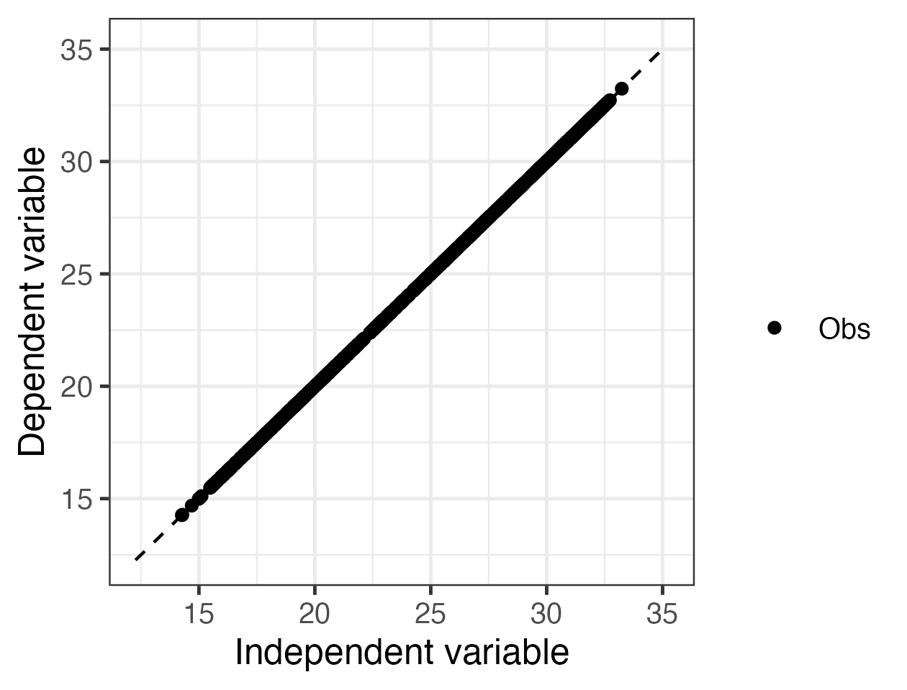

```{r setup, include=FALSE}
knitr::opts_chunk$set(echo = FALSE)
```

```{r}
time <- Sys.time()

# Add last update time
app_time <- format(file.info("ui.R")$mtime, "%Y-%m-%d")
app_update_txt <- paste0("This app was last updated on: ", app_time)

# Read in assessment questions
quest <- read.csv("data/student_questions.csv", row.names = 1)

# Make tables
lake_tab <- data.frame("Characteristic" = c(substr(quest["q3a", ], 3, nchar(quest["q3a", ])),substr(quest["q3b", ], 3, nchar(quest["q3b", ])),substr(quest["q3c", ], 3, nchar(quest["q3c", ])),substr(quest["q3d", ], 3, nchar(quest["q3d", ])),substr(quest["q3e", ], 3, nchar(quest["q3e", ])),
                                            substr(quest["q3f", ], 3, nchar(quest["q3f", ]))),
                       "Answer" = rep("",6))

wtemp_tab <- data.frame("Variable" = c("Surface water temperature"),
                          "Mean" = rep("",1),
                          "Minimum" = rep("",1),
                          "Maximum" = rep("",1))

atemp_tab <- data.frame("Variable" = c("Air temperature"),
                          "Mean" = rep("",1),
                          "Minimum" = rep("",1),
                          "Maximum" = rep("",1))

lr_pars_tab <- data.frame("Model" = c("Water temp.","Air temp."),
                          "Slope (m)" = rep("",2),
                          "Intercept (b)" = rep("",2))

mlr_pars_tab <- data.frame("Model" = c("Water temp. and air temp."),
                          "β0" = rep("",1),
                          "β1" = rep("",1),
                          "β2" = rep("",1))

evolving_pars_tab <- data.frame("Model" = c("1 year model","2 year model"),
                          "Slope (m)" = rep("",2),
                          "Intercept (b)" = rep("",2))

# Load in text
module_text <- read.csv("data/module_text.csv", row.names = 1, header = FALSE)
```


***
### Name: 
### Student ID: 
#### Completed on: 
#### Copy-paste your save progress link from the Shiny app here for ease of reference:
***

# Learning Objectives:

By the end of this module, you will be able to:

- Define ecological forecast uncertainty
- Explore the contributions of different sources of uncertainty (e.g., model parameters, model driver data) to total forecast uncertainty
- Outline how multiple sources of uncertainty are quantified
- Identify ways in which uncertainty can be reduced within an ecological forecast
- Describe how forecast horizon affects forecast uncertainty
- Explain the importance of specifying uncertainty in ecological forecasts for application


# Why macrosystems ecology and ecological forecasting?

**Macrosystems ecology** is the study of ecological dynamics at multiple interacting spatial and temporal scales (e.g., Heffernan et al. 2014). For example, _global_ climate change can interact with _local_ land-use activities to control how an ecosystem changes over the next decades. Macrosystems ecology recently emerged as a new sub-discipline of ecology to study ecosystems and ecological communities around the globe that are changing at an unprecedented rate because of human activities (IPCC 2013). The responses of ecosystems and communities are complex, non-linear, and driven by feedbacks across local, regional, and global scales (Heffernan et al. 2014). These characteristics necessitate novel approaches for making predictions about how systems may change to improve both our understanding of ecological phenomena as well as inform resource management.  


**Forecasting** is a tool that can be used for understanding and predicting macrosystems dynamics. To anticipate and prepare for increased variability in populations, communities, and ecosystems, there is a pressing need to know the future state of ecological systems across space and time (Dietze et al. 2018). Ecological forecasting is an emerging approach which provides an estimate of the future state of an ecological system with uncertainty, allowing society to prepare for changes in important ecosystem services. Ecological forecasts are a powerful test of the scientific method because ecologists make a hypothesis of how an ecological system works; embed their hypothesis in a model; use the model to make a forecast of future conditions; and then when observations become available, assess the accuracy of their forecast, which indicates if their hypothesis is supported or needs to be updated. Forecasts that are effectively communicated to the public and managers will be most useful for aiding decision-making. Consequently, macrosystems ecologists are increasingly using ecological forecasts to predict how ecosystems are changing over space and time (Dietze and Lynch 2019).  
  
In this module, students will generate an ecological forecast for a NEON site and quantify the different sources of uncertainty within their forecast. This module will introduce students to the conceptof uncertainty within an ecological forecast; where uncertainty in a forecast comes from; how uncertainty can be quantified within a forecast; and how uncertainty can be managed.  
  
## Module overview:

- Introduction to Ecological Forecasting: pre-readings and PowerPoint in class
- Activity A: Build different models to simulate water temperature for their chosen NEON site.
- Activity B: Generate multiple forecasts of water temperature with different sources of uncertainty and examine how uncertainty propagation differs.
- Activity C: Quantify and partition the uncertainty for their forecasts with different models and make management decisions using an ecological forecast.  
  
## Today's focal question: _Where does forecast uncertainty come from and how can it be quantified and reduced?_

To address this question, we will introduce ecological forecasts and the iterative forecasting cycle. We will build a model that forecasts water temperature with uncertainty. We will then explore the different sources of uncertainty associated with our forecast predictions. In this module, we will use our model to examine where forecast uncertainty comes from and how it propagates through time due to driver data, model parameters, and initial conditions. We will then quantify the sources of uncertainty in forecasts and compare between models and then make a management decision using information from a forecast.  
  
We will be using ecological data collected by the National Ecological Observation Network (NEON) to tackle this question. NEON is a continental-scale observatory designed to collect publicly-available, long-term ecological data to monitor changing ecosystems across the U.S. Water temperature exerts a major influence on biological activity and growth, has an effect on water chemistry, can influence water quantity measurements, and governs the kinds of organisms that live in water bodies.  
  
## R Shiny App:
  
The lesson content is hosted on an R Shiny App at [https://macrosystemseddie.shinyapps.io/module6/](https://macrosystemseddie.shinyapps.io/module6/).  
  
This can be accessed via any internet browser and allows you to navigate through the lesson via this app. You will fill in the questions below on this handout as you complete the lesson activities.  
  
## Optional pre-class readings and video:  
  
Webpages:  
  
- [NOAA Ecological Forecasts](https://oceanservice.noaa.gov/ecoforecasting/noaa.html#:~:text=What%20is%20ecological%20forecasting%3F,%2C%20pollution%2C%20or%20habitat%20change.)

- [Ecological Forecasting Initiative](https://ecoforecast.org/about/)
  
Articles:  
  
- Dietze, M. and Lynch, H. 2019. Forecasting a bright future for ecology. _Frontiers in Ecology and the Environment_, _17_(1), 3.
[https://doi.org/10.1002/fee.1994](https://doi.org/10.1002/fee.1994)

- Dietze, M.C., et al. 2018. Iterative near-term ecological forecasting: Needs, opportunities, and challenges. Proceedings of the National Academy of Sciences, 115(7), 1424–1432. [https://doi.org/10.1073/pnas.1710231115](https://doi.org/10.1073/pnas.1710231115)

- Jackson, L.J., Trebitz, A.S., &amp; Cottingham, K.L. 2000. An introduction to the practice of ecological modeling. BioScience, 50(8), 694. [https://doi.org/10.1641/0006-3568(2000)050[0694:aittpo]2.0.co;2](https://doi.org/10.1641/0006-3568(2000)050%5B0694:aittpo%5D2.0.co;2) 
  
Videos:  
  
- NEON&#39;s [Ecological Forecast: The Science of Predicting Ecosystems](https://www.youtube.com/watch?v=Lgi_e7N-C8E&amp;t=196s&amp;pbjreload=101)

- Fundamentals of Ecological Forecasting Series: [Why Forecast?](https://www.youtube.com/watch?v=kq0DTcotpA0&amp;list=PLLWiknuNGd50Lc3rft4kFPc_oxAhiQ-6s&amp;index=1)

\newpage

## Pre-class activity: Explore how uncertainty in predictions can affect decision-making
  
Read the following paper, which you can either access independently online or obtain from your instructor:  
  
*Pielke, R. A. (1999). Who decides? Forecasts and responsibilities in the 1997 Red River flood. Applied Behavioral Science Review, 7(2), 83–101.*   
  
#### Refer to the paper you read to answer the questions below.  
  
A.  Ahead of the 1997 Red River flood in East Grand Forks, the National Weather Service (NWS) provided two river crest predictions of 47.5 and 49 ft. How were these two different predictions made? (What was the difference between the two predictions?). 

    **Answer:** 


B.  Pielke reports that many people misinterpreted the two river crest predictions provided by the NWS. Describe two ways in which the river crest predictions were incorrectly interpreted.

    **Answer:** 


C.  The NWS did not quantify or report the uncertainty associated with its river crest predictions for the 1997 Red River flood event. Referring to Fig. 2 in the paper, what do you think would be a reasonable estimate of the uncertainty associated with NWS river crest predictions? Explain your reasoning.

    **Answer:** 


D.  Pielke concludes that "Confusion about the uncertainty of the [river crest] predictions led to misplaced responsibility for flood fight decision making." Explain what is meant by this statement in your own words.

    **Answer:** 


E.  Reflecting on what you have read, explain how reporting, or failing to report, the uncertainty associated with future predictions of natural phenomena can affect decision-making.

    **Answer:** 


Now navigate to the [Shiny interface](https://macrosystemseddie.shinyapps.io/module5) to answer the rest of the questions.

The questions you must answer are written both in the Shiny interface as well as in this handout. As you go, you should fill out your answers in this document.

\newpage

# Think about it!  
  
Answer the following questions:  
  
1. `r substr(quest["q1", ], 4, nchar(quest["q1", ]))` 

    **Answer:** 

2. `r substr(quest["q2", ], 4, nchar(quest["q2", ]))`  

    **Answer:** 

# Activity A - Build Models and Generate Forecasts

`r module_text["act_A", ]`

## Objective 1: Select and view a NEON site

***
`r module_text["obj_01", ]`

***

3. `r substr(quest["q3", ], 4, nchar(quest["q3", ]))` 

     a.  `r substr(quest["q3a", ], 3, nchar(quest["q3a", ]))` 

     b.  `r substr(quest["q3b", ], 3, nchar(quest["q3b", ]))`
     
     c.  `r substr(quest["q3c", ], 3, nchar(quest["q3c", ]))` 

     d.  `r substr(quest["q3d", ], 3, nchar(quest["q3d", ]))`
     
     e.  `r substr(quest["q3e", ], 3, nchar(quest["q3e", ]))` 

     f.  `r substr(quest["q3f", ], 3, nchar(quest["q3f", ]))`

   
<br>

## Objective 2: Explore water temperature

***
`r module_text["obj_02", ]`

***

4. `r substr(quest["q4", ], 4, nchar(quest["q4", ]))`  

    **Answer:** 

5. `r substr(quest["q5", ], 4, nchar(quest["q5", ]))`    

    **Answer:**

6. `r substr(quest["q6", ], 4, nchar(quest["q6", ]))`    

    *Table 1. Water Temperature Statistics*
    
    | **Variable** | **Mean** | **Minimum** | **Maximum** |
    | --- | --- | --- | --- |
    | Surface water temperature |  |  |  |   
    
    <br>
    
7. `r substr(quest["q7", ], 4, nchar(quest["q7", ]))`    

    *Table 2. Air Temperature Statistics*   
    
    | **Variable** | **Mean** | **Minimum** | **Maximum** |
    | --- | --- | --- | --- |
    | Air temperature |  |  |  |  
    
    <br>
    
8. `r substr(quest["q8", ], 4, nchar(quest["q8", ]))`

     a.  `r substr(quest["q8a", ], 3, nchar(quest["q8a", ]))` 

           *Please copy-paste your Q-8a-plot.png image here.*

           *Figure 1. Time series of air and water temperature for your                    selected NEON lake.*

     b.  `r substr(quest["q8b", ], 3, nchar(quest["q8b", ]))`\ 

           **Answer:**   

<br>

## Objective 3: Build models

***
`r module_text["obj_03", ]`

***

9. `r substr(quest["q9", ], 4, nchar(quest["q9", ]))`    

    **Answer:**

10. `r substr(quest["q10", ], 5, nchar(quest["q10", ]))`    

     **Answer:**

11. `r substr(quest["q11", ], 5, nchar(quest["q11", ]))`

      a.  `r substr(quest["q11a", ], 3, nchar(quest["q11a", ]))` 

           *Please copy-paste your Q-11a-plot.png image here.*

           *Figure 2. Time series of persistence model predictions and water               temperature observations for your selected NEON lake.*

      b.  `r substr(quest["q11b", ], 3, nchar(quest["q11b", ]))` 

           **Answer:**   


12. `r substr(quest["q12", ], 5, nchar(quest["q12", ]))`    

     **Answer:**

13. `r substr(quest["q13", ], 5, nchar(quest["q13", ]))`

      a.  `r substr(quest["q13a", ], 3, nchar(quest["q13a", ]))` 

            *Please copy-paste your Q-13a-plot.png image here.*

            *Figure 3. Scatterplot of today's water temperature observations                versus yesterday's water temperature observations for your                     selected NEON lake.*

      b.  `r substr(quest["q13b", ], 3, nchar(quest["q13b", ]))` 
         
            **Answer:**   


14. `r substr(quest["q14", ], 5, nchar(quest["q14", ]))`

      a.  `r substr(quest["q14a", ], 3, nchar(quest["q14a", ]))` 

            *Please copy-paste your Q-14a-plot.png image here.*\

            *Figure 4. Scatterplot of today's water temperature observations                versus today's air temperature observations for your selected NEON             lake.*

      b.  `r substr(quest["q14b", ], 3, nchar(quest["q14b", ]))`: 
         
            **Answer:**   


15. `r substr(quest["q15", ], 5, nchar(quest["q15", ]))`    

     {width=200px}    
       
     **Answer:**
     

16. `r substr(quest["q16", ], 5, nchar(quest["q16", ]))`

      a.  `r substr(quest["q16a", ], 3, nchar(quest["q16a", ]))` 
         
            *Table 3. Linear Regression Parameters*     
            
            | **Model** | **Slope (m)** | **Intercept (b)** |
            | --- | --- | --- |
            | Water temperature |  |  |
            | Air temperature |  |  |    
            
            <br>
            
      b.  `r substr(quest["q16b", ], 3, nchar(quest["q16b", ]))` 
    
            **Answer:**   


17. `r substr(quest["q17", ], 5, nchar(quest["q17", ]))`

      a.  `r substr(quest["q17a", ], 3, nchar(quest["q17a", ]))` 
         
            *Table 4. Multiple Linear Regression Parameters*
            
            | **Model** | **β0** | **β1** | **β2** |
            | --- | --- | --- | --- |
            | Water temp. and air temp. |  |  |  |   
            
            <br>

      b.  `r substr(quest["q17b", ], 3, nchar(quest["q17b", ]))` 
    
            **Answer:**   


18. `r substr(quest["q18", ], 5, nchar(quest["q18", ]))`

      a.  `r substr(quest["q18a", ], 3, nchar(quest["q18a", ]))` 

            *Please copy-paste your Q-18a-plot.png image here.*

            *Figure 6. Time series of model predictions and water temperature               observations for your selected NEON lake.*

      b.  `r substr(quest["q18b", ], 3, nchar(quest["q18b", ]))` 
    
            **Answer:**   

<br>

## Objective 4: Generate Forecasts

***
`r module_text["obj_04", ]`

***

19. `r substr(quest["q19", ], 5, nchar(quest["q19", ]))`

      a.  `r substr(quest["q19a", ], 3, nchar(quest["q19a", ]))` 

            *Please copy-paste your Q-19a-plot.png image here.*

            *Figure 7. Deterministic water temperature forecasts for your                   selected NEON lake.*

      b.  `r substr(quest["q19b", ], 3, nchar(quest["q19b", ]))`: 
            
            **Answer:**   


20. `r substr(quest["q20", ], 5, nchar(quest["q20", ]))`

     **Answer:** 

\newpage

# Activity B - Explore Forecast Uncertainty

`r module_text["act_B", ]`

## Objective 5: Process Uncertainty

***
`r module_text["obj_05", ]`

***

21. `r substr(quest["q21", ], 5, nchar(quest["q21", ]))`

     **Answer:** 

22. `r substr(quest["q22", ], 5, nchar(quest["q22", ]))`

     **Answer:** 

23. `r substr(quest["q23", ], 5, nchar(quest["q23", ]))`

     **Answer:** 

24. `r substr(quest["q24", ], 5, nchar(quest["q24", ]))`

      a.  `r substr(quest["q24a", ], 3, nchar(quest["q24a", ]))`: 

            *Please copy-paste your Q-24a-plot.png image here.*

            *Figure 8. Distributions of process uncertainty for all four                    models.*

      b.  `r substr(quest["q24b", ], 3, nchar(quest["q24b", ]))`: 
           
            **Answer:**   


25. `r substr(quest["q25", ], 5, nchar(quest["q25", ]))`

      a.  `r substr(quest["q25a", ], 3, nchar(quest["q25a", ]))` 

            *Please copy-paste your Q-25a-plot.png image here.*\

            *Figure 9. Water temperature forecasts with process uncertainty for              your selected NEON lake.*

      b.  `r substr(quest["q25b", ], 3, nchar(quest["q25b", ]))`: 
    
            **Answer:**   


26. `r substr(quest["q26", ], 5, nchar(quest["q26", ]))`

     **Answer:** 

<br>

## Objective 6: Parameter Uncertainty

***
`r module_text["obj_06", ]`

***

27. `r substr(quest["q27", ], 5, nchar(quest["q27", ]))`

      a.  `r substr(quest["q27a", ], 3, nchar(quest["q27a", ]))` 
            
            *Table 5. Parameters for Linear Regressions Fit to Different                    Datasets*
            
            | **Model** | **Slope (m)** | **Intercept (b)** |
            | --- | --- | --- |
            | 1 year model |  |  |
            | 2 year model |  |  |
            
            <br>

      b.  `r substr(quest["q27b", ], 3, nchar(quest["q27b", ]))` 
          
            **Answer:**   


28. `r substr(quest["q28", ], 5, nchar(quest["q28", ]))`

      a.  `r substr(quest["q28a", ], 3, nchar(quest["q28a", ]))` 

            *Please copy-paste your Q-28a-plot.png image here.*

            *Figure 10. Water temperature forecasts with parameter uncertainty              for your selected NEON lake.*

      b.  `r substr(quest["q28b", ], 3, nchar(quest["q28b", ]))` 
    
            **Answer:**   
            

29. `r substr(quest["q29", ], 5, nchar(quest["q29", ]))`

     **Answer:** 

<br>

## Objective 7: Initial Conditions Uncertainty

***
`r module_text["obj_07", ]`

***

30. `r substr(quest["q30", ], 5, nchar(quest["q30", ]))`

     **Answer:**

31. `r substr(quest["q31", ], 5, nchar(quest["q31", ]))`

     **Answer:**

32. `r substr(quest["q32", ], 5, nchar(quest["q32", ]))`

      a.  `r substr(quest["q32a", ], 3, nchar(quest["q32a", ]))` 

            *Please copy-paste your Q-32a-plot.png image here.*

            *Figure 11. Water temperature forecasts with initial conditions                 uncertainty for your selected NEON lake.*

      b.  `r substr(quest["q32b", ], 3, nchar(quest["q32b", ]))` 
    
            **Answer:**   


33. `r substr(quest["q33", ], 5, nchar(quest["q33", ]))`

     **Answer:**

<br>

## Objective 8: Driver Uncertainty

***
`r module_text["obj_08", ]`

***

34. `r substr(quest["q34", ], 5, nchar(quest["q34", ]))`

      a.  `r substr(quest["q34a", ], 3, nchar(quest["q34a", ]))` 

            *Please copy-paste your Q-34a-plot.png image here.*

            *Figure 12. Water temperature forecasts with driver uncertainty for              your selected NEON lake.*

      b.  `r substr(quest["q34b", ], 3, nchar(quest["q34b", ]))` 
   
            **Answer:**   


35. `r substr(quest["q35", ], 5, nchar(quest["q35", ]))`

     **Answer:**

\newpage 

# Activity C - Managing Uncertainty

`r module_text["act_C", ]`

## Objective 9: Quantify Uncertainty

***
`r module_text["obj_09", ]`

***

36. `r substr(quest["q36", ], 6, nchar(quest["q36", ]))`

      a.  `r substr(quest["q36a", ], 3, nchar(quest["q36a", ]))`  
    
            **Answer:**  
    
      b.  `r substr(quest["q36b", ], 3, nchar(quest["q36b", ]))`  
    
            *Please copy-paste your Q-36b-plot.png image here.*

            *Figure 13. Total forecast uncertainty partitioned among process,               parameter, initial conditions, and driver uncertainty for model                1.*

      c.  `r substr(quest["q36c", ], 3, nchar(quest["q36c", ]))`  
    
            **Answer:**   
    
    
37. `r substr(quest["q37", ], 6, nchar(quest["q37", ]))`

      a.  `r substr(quest["q37a", ], 3, nchar(quest["q37a", ]))`  
    
            **Answer:**  
    
      b.  `r substr(quest["q37b", ], 3, nchar(quest["q37b", ]))`  
    
            *Please copy-paste your Q-37b-plot.png image here.*

            *Figure 14. Total forecast uncertainty partitioned among process,               parameter, initial conditions, and driver uncertainty for model                2.*
            
      c.  `r substr(quest["q37c", ], 3, nchar(quest["q37c", ]))`  
    
            **Answer:**   
    

38. `r substr(quest["q38", ], 5, nchar(quest["q38", ]))`

     **Answer:**

<br>

## Objective 10: Management Scenario

***
`r module_text["obj_10", ]`

***

39. `r substr(quest["q39", ], 5, nchar(quest["q39", ]))`

     **Answer:**


40. `r substr(quest["q40", ], 5, nchar(quest["q40", ]))`

     **Answer:**

<br>

*`r module_text["acknowledgement", ]`*
*`r app_update_txt`*
