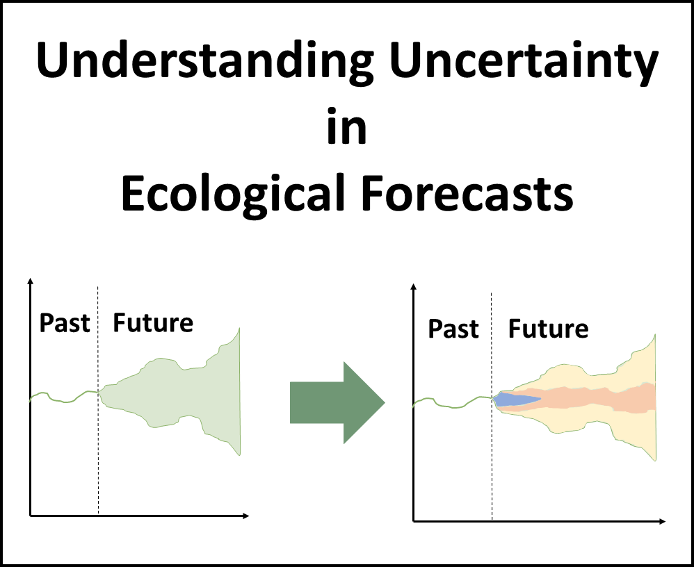

```{r setup, include=FALSE}
knitr::opts_chunk$set(echo = FALSE)
```
```{r}
time <- Sys.time()

# Add last update time
app_time <- format(file.info("ui.R")$mtime, "%Y-%m-%d")
app_update_txt <- paste0("This app was last updated on: ", app_time)

# Read in assessment questions
# Load and format questions
quest <- read.csv("data/student_questions.csv", row.names = 1)

idx <- which(grepl("Name of selected ", quest$Question))
idx2 <- which(grepl("Elevation", quest$Question))
# Number rows
row.names(quest) <- NULL
row.names(quest)[1:(idx-1)] <- paste0("q", 1:(idx-1))
row.names(quest)[idx:(idx2)] <- paste0("q", (idx-1), letters[1:length(idx:idx2)])
row.names(quest)[(idx2+1):nrow(quest)] <- paste0("q", ((idx2+1):nrow(quest) - 6))
qid <- row.names(quest)
# Number location
quest$location[1:(idx-1)] <- paste0(quest$location[1:(idx-1)], " - Q.", 1:(idx-1))
# quest$location[idx:(idx2)] <- paste0(quest$location[idx:idx2],letters[1:length(idx:idx2)], ". ", )
quest$location[(idx2+1):nrow(quest)] <- paste0(quest$location[(idx2+1):nrow(quest)], " - Q.", ((idx2+1):nrow(quest) - 6))

answers <- params$answers

if(length(params$plot_list) == 1) {
  plot_list <- list(airt_wtemp_ts = NA,
                      lr_mod_ts = NA,
                      param_dist_lr = NA,
                      pers_mod = NA,
                      mlr_mod_ts = NA,
                      deter_fc = NA,
                      proc_uc_fc = NA,
                      param_dist_fc = NA,
                      param_uc_fc = NA,
                      ic_ts_dist = NA,
                      ic_uc_fc = NA,
                      airt_fc = NA,
                      driver_uc_fc = NA,
                      all_fc = NA,
                      tot_uc_fc1 = NA,
                      quant_uc_fc1 = NA,
                      tot_uc_fc2 = NA,
                      quant_uc_fc2 = NA,
                      dec1 = NA,
                      dec2 = NA)
} else {
  plot_list <- params$plot_list
}

# plot_list[[1]] <- "www/out_plots/airt_wtemp_ts.png"

plt_chk <- lapply(plot_list, function(x) {
  if(is.na(x)) {
    return(FALSE)
  } else {
    file.exists(x)
  }
})
incr <- 1

# Read in tables
tab_lr <- read.csv("data/out_tables/tab_lr.csv")
tab_lr[is.na(tab_lr)] <- ""
tab_mlr <- read.csv("data/out_tables/tab_mlr.csv")
tab_mlr[is.na(tab_mlr)] <- ""
tab_models <- read.csv("data/out_tables/tab_models.csv", row.names = 1)
tab_models[is.na(tab_models)] <- ""

test_eqn <- "$$wtemp_{t+1} =  1 \\times  wtemp_{t}-0.02 $$"

if(length(answers) == 1) {
  answers <- quest
  quest$location <- NULL
  colnames(answers)[1] <- "Answer"
  answers[, 1] <- ""
}

# Load in text
module_text <- read.csv("data/module_text.csv", row.names = 1, header = FALSE)

# Check for existence of files
pheno_chk <- !is.null(params$pheno_file)

if(!is.null(params$mod_selec1)) {
  idx <- which(row.names(tab_models) == params$mod_selec1)
  mod_eqn1 <- tab_models[idx, 1]
} else{
    mod_eqn1 <- ""
}

if(!is.null(params$mod_selec2)) {
  idx <- which(row.names(tab_models) == params$mod_selec2)
  mod_eqn2 <- tab_models[idx, 1]
} else {
  mod_eqn2 <- ""
}

dec1 <- params$dec1
dec2 <- params$dec2


```


***
### Name: `r params$name`  
### Student ID: `r params$id_number` 
#### Completed on: `r time`
***

# **Macrosystems EDDIE Module 6: Understanding Uncertainty in Ecological Forecasts**


# Learning Objectives:

By the end of this module, you will be able to:

- Define ecological forecast uncertainty
- Explore the contributions of different sources of uncertainty (e.g., model parameters, model driver data) to total forecast uncertainty
- Outline how multiple sources of uncertainty are quantified
- Identify ways in which uncertainty can be reduced within an ecological forecast
- Describe how forecast horizon affects forecast uncertainty
- Explain the importance of specifying uncertainty in ecological forecasts for application
\

```{r, echo=FALSE, fig.align="center", out.width="200px", fig.cap=""}

```


# Why macrosystems ecology and ecological forecasting?

**Macrosystems ecology** is the study of ecological dynamics at multiple interacting spatial and temporal scales (e.g., Heffernan et al. 2014). For example, _global_ climate change can interact with _local_ land-use activities to control how an ecosystem changes over the next decades. Macrosystems ecology recently emerged as a new sub-discipline of ecology to study ecosystems and ecological communities around the globe that are changing at an unprecedented rate because of human activities (IPCC 2013). The responses of ecosystems and communities are complex, non-linear, and driven by feedbacks across local, regional, and global scales (Heffernan et al. 2014). These characteristics necessitate novel approaches for making predictions about how systems may change to improve both our understanding of ecological phenomena as well as inform resource management.  


**Forecasting** is a tool that can be used for understanding and predicting macrosystems dynamics. To anticipate and prepare for increased variability in populations, communities, and ecosystems, there is a pressing need to know the future state of ecological systems across space and time (Dietze et al. 2018). Ecological forecasting is an emerging approach which provides an estimate of the future state of an ecological system with uncertainty, allowing society to prepare for changes in important ecosystem services. Ecological forecasts are a powerful test of the scientific method because ecologists make a hypothesis of how an ecological system works; embed their hypothesis in a model; use the model to make a forecast of future conditions; and then when observations become available, assess the accuracy of their forecast, which indicates if their hypothesis is supported or needs to be updated. Forecasts that are effectively communicated to the public and managers will be most useful for aiding decision-making. Consequently, macrosystems ecologists are increasingly using ecological forecasts to predict how ecosystems are changing over space and time (Dietze and Lynch 2019).  
\
In this module, students will generate an ecological forecast for a NEON site and quantify the different sources of uncertainty within their forecast. This module will introduce students to the conceptof uncertainty within an ecological forecast; where uncertainty in a forecast comes from; how uncertainty can be quantified within a forecast; and how uncertainty can be managed.  \

## Module overview:

- Introduction to Ecological Forecasting: pre-readings and PowerPoint in class
- Activity A: Build different models to simulate water temperature for their chosen NEON site.
- Activity B: Generate multiple forecasts of water temperature with different sources of uncertainty and examine how uncertainty propagation differs.
- Activity C: Quantify and partition the uncertainty for their forecasts with different models and make management decisions using an ecological forecast.
\

## Today's focal question: _Where does forecast uncertainty come from and how can it be quantified and reduced?_

To address this question, we will introduce ecological forecasts and the iterative forecasting cycle. We will build a model that forecasts water temperature with uncertainty. We will then explore the different sources of uncertainty associated with our forecast predictions. In this module, we will use our model to examine where forecast uncertainty comes from and how it propagates through time due to driver data, model parameters, and initial conditions. We will then quantify the sources of uncertainty in forecasts and compare between models and then make a management decision using information from a forecast.

We will be using ecological data collected by the National Ecological Observation Network (NEON) to tackle this question. NEON is a continental-scale observatory designed to collect publicly-available, long-term ecological data to monitor changing ecosystems across the U.S. Water temperature exerts a major influence on biological activity and growth, has an effect on water chemistry, can influence water quantity measurements, and governs the kinds of organisms that live in water bodies.

## R Shiny App:

The lesson content is hosted on an R Shiny App at [https://macrosystemseddie.shinyapps.io/module6/](https://macrosystemseddie.shinyapps.io/module6/)  
This can be accessed via any internet browser and allows you to navigate through the lesson via this app. You will fill in the questions below on this handout as you complete the lesson activities.

## Optional pre-class readings and video:

Webpages:

- [NOAA Ecological Forecasts](https://oceanservice.noaa.gov/ecoforecasting/noaa.html#:~:text=What%20is%20ecological%20forecasting%3F,%2C%20pollution%2C%20or%20habitat%20change.)
- [Ecological Forecasting Initiative](https://ecoforecast.org/about/)

Articles:

- Dietze, M. and Lynch, H. 2019. Forecasting a bright future for ecology. _Frontiers in Ecology and the Environment_, _17_(1), 3. [https://doi.org/10.1002/fee.1994](https://doi.org/10.1002/fee.1994)
- Dietze, M.C., et al. 2018. Iterative near-term ecological forecasting: Needs, opportunities, and challenges. Proceedings of the National Academy of Sciences, 115(7), 1424–1432. [https://doi.org/10.1073/pnas.1710231115](https://doi.org/10.1073/pnas.1710231115)
- Jackson, L.J., Trebitz, A.S., &amp; Cottingham, K.L. 2000. An introduction to the practice of ecological modeling. BioScience, 50(8), 694. [https://doi.org/10.1641/0006-3568(2000)050[0694:aittpo]2.0.co;2](https://doi.org/10.1641/0006-3568(2000)050%5B0694:aittpo%5D2.0.co;2)

Videos:

- NEON&#39;s [Ecological Forecast: The Science of Predicting Ecosystems](https://www.youtube.com/watch?v=Lgi_e7N-C8E&amp;t=196s&amp;pbjreload=101)
- Fundamentals of Ecological Forecasting Series: [Why Forecast?](https://www.youtube.com/watch?v=kq0DTcotpA0&amp;list=PLLWiknuNGd50Lc3rft4kFPc_oxAhiQ-6s&amp;index=1)

The questions you must answer are embedded in the Shiny interface. You can answer the questions there and generate a report at the end or you can fill out the questions within this document.

# Think about it!
\
Answer the following questions:

1. `r quest[qid[1], 1]`  
\
**Answer:** `r answers[qid[1], 1]`\

2. `r quest[qid[2], 1]`   
\
**Answer:** `r answers[qid[2], 1]`\


Now navigate to the [Shiny interface](https://macrosystemseddie.shinyapps.io/module6) to answer the rest of the questions.

# Site Selection

## Objective 1: Select and view a NEON site\

***
`r module_text["obj_01", ]`

***

```{r results='asis', echo=FALSE}
if (!pheno_chk) {cat("<!---")}
```
  
*Figure 1. Phenocam image downloaded for `r answers[qid[4], 1]`.*
```{r results='asis', echo=FALSE}
if (!pheno_chk) {cat("-->")}
```
\

3. `r quest[qid[3], 1]`  
\

*Table 1. Site Characteristics*

| | |
| --- | --- |
| `r quest[qid[4], 1]` | `r answers[qid[4], 1]` |
| `r quest[qid[5], 1]` | `r answers[qid[5], 1]` |
| `r quest[qid[6], 1]` | `r answers[qid[6], 1]` |
| `r quest[qid[7], 1]` | `r answers[qid[7], 1]` |
| `r quest[qid[8], 1]` | `r answers[qid[8], 1]` |
| `r quest[qid[9], 1]` | `r answers[qid[9], 1]` |
\

## Objective 2: Explore data\

***
If there are some variables which you are not familiar with, visit the [NEON Data Portal](https://data.neonscience.org/home) and click 'Explore Data Products' to learn more about how the data are collected.

***

4. `r quest[qid[10], 1]`  
\
**Answer:** `r answers[qid[10], 1]`\

5. `r quest[qid[11], 1]`   
\
**Answer:** `r answers[qid[11], 1]`\


# Activity A - Build a Model with Uncertainty

`r module_text["act_A", ]`

## Objective 3: Build a water temperature model\

***
`r module_text["obj_03", ]`

***

### Water Temperature
\
**Water temperature** exerts a major influence on biological activity and growth, has an effect on water chemistry, can influence water quantity measurements, and governs the kinds of organisms that live in water bodies. Water temperature can have important effects on water quality, as changes in water temperature can directly or indirectly affect water quality variables such as dissolved oxygen, nutrient and heavy metal concentrations, and algae concentrations. Freshwater ecosystems are currently experiencing a multitude of stressors such as land use change and climate change, which can affect water temperature. Being able to predict how water temperature may change in the short-term (up to 7-days into the future) can provide natural resource managers with critical information to take pro-active actions to prevent degradation of water quality.
\

6. `r quest[qid[12], 1]`  
\
**Answer:** `r answers[qid[12], 1]`  
\


```{r results='asis', echo=FALSE}
if (!plt_chk$airt_wtemp_ts) {cat("<!---")}
```
  
*Figure 2. Timeseries of air temperature and water temperature measurements.*
```{r results='asis', echo=FALSE}
if (!plt_chk$airt_wtemp_ts) {cat("-->")}
```

7. `r quest[qid[13], 1]`  
\
**Answer:** `r answers[qid[13], 1]`  
\

8. `r quest[qid[14], 1]`  
\
**Answer:** `r answers[qid[14], 1]`  
\

```{r results='asis', echo=FALSE}
if (!plt_chk$lr_mod_ts) {cat("<!---")}
```
  
*Figure 3. Timeseries of observed water temperature (points) with linear regression models fitted to data collected at different frequencies. *
```{r results='asis', echo=FALSE}
if (!plt_chk$lr_mod_ts) {cat("-->")}
```

9. `r quest[qid[15], 1]`  
\
**Answer:** `r answers[qid[15], 1]`  
\

10. `r quest[qid[16], 1]`  
\
**Answer:** `r answers[qid[16], 1]`  
\

Table 1. Linear regression models fitted using data collected at different frequencies.

| **Frequency** | **Equation** | **RMSE** |
| --- | --- | --- |
| Monthly | `r tab_lr[1, 1]` | `r tab_lr[1, 2]` |
| Fortnightly | `r tab_lr[2, 1]` | `r tab_lr[2, 2]` |
| Weekly |`r tab_lr[3, 1]` | `r tab_lr[3, 2]` |
| Daily | `r tab_lr[4, 1]` | `r tab_lr[4, 2]` |
\


## Objective 4: Explore Parameters\

***
`r module_text["obj_04", ]`

***

### Generate distributions for intercept & slope
\
When fitting the models to the data in the previous objective, a standard error of the estimated parameters is calculated. The standard error of the coefficient measures how precisely the model estimates the coefficient's unknown value. It is the standard deviation around the estimate of the parameter and can be visualized by drawing a normal distribution with the mean as the parameter estimate and the standard error as the standard deviation. Generate plots of the normal distribution of the parameters (m and b) using the mean and standard deviation from the models you fit by selecting a row in the table and clicking 'Generate plot'. **Density plots** are used to observe the distribution of a variable in a dataset. Density plots are a variation of histograms and they are better at determining the distribution shape.
\

11. `r quest[qid[17], 1]`  
\
**Answer:** `r answers[qid[17], 1]`  
\

```{r results='asis', echo=FALSE}
if (!plt_chk$param_dist_lr) {cat("<!---")}
```
  
*Figure 4. Distribution of parameter values calculated from linear regressions fit to data collected at different frequencies. *
```{r results='asis', echo=FALSE}
if (!plt_chk$param_dist_lr) {cat("-->")}
```

## Objective 5: Improve Model for Forecasting\

***
`r module_text["obj_05", ]`

***

### Create a Forecast model
\
The model built in Objective 3 uses current air temperature to predict current water temperature. But, if we want to make a forecast of future water temperature, we would be unable to use this model unless we used forecasted (future) air temperature. The simplest forecast model that we can create is to predict that tomorrow's water temperature will be the same as today’s water temperature. This is called a **persistence model.**
\

### Persistence model\

```{r results='asis', echo=FALSE}
if (!plt_chk$pers_mod) {cat("<!---")}
```
  
*Figure 5. Timeseries of water temperature observations (points) and persistence model predictions (line). *
```{r results='asis', echo=FALSE}
if (!plt_chk$pers_mod) {cat("-->")}
```


### Build a better model
\
We are now going to build two models that we will use to forecast water temperature.
\
\
A. A linear regression using today's water temperature to predict tomorrow's water temperature
\
B. A multiple linear regression using today's water temperature and tomorrow's air temperature to predict tomorrow's water temperature
\

12. `r quest[qid[18], 1]`  
\
**Answer:** `r answers[qid[18], 1]`  
\

```{r results='asis', echo=FALSE}
if (!plt_chk$mlr_mod_ts) {cat("<!---")}
```
  
*Figure 6. Timeseries of water temperature observations (points) with linear regression and multiple linear regression predictions (lines).*
```{r results='asis', echo=FALSE}
if (!plt_chk$mlr_mod_ts) {cat("-->")}
```
\
Table 2. Models fit to the data that are more suitable for forecasting.

| **Model** | **Equation** | **RMSE** |
| --- | --- | --- |
| Wtemp |`r tab_mlr[1, 1]` | `r tab_mlr[1, 3]` |
| Both | `r tab_mlr[2, 1]` | `r tab_mlr[2, 3]` |
\


13. `r quest[qid[19], 1]`  
\
**Answer:** `r answers[qid[19], 1]`  
\
14. `r quest[qid[20], 1]`  
\
**Answer:** `r answers[qid[20], 1]`  
\
15. `r quest[qid[21], 1]`  
\
**Answer:** `r answers[qid[21], 1]`  
\


# Activity B: Explore Forecast Uncertainty\

`r module_text["act_B", ]`  

## Overview\

***
`r module_text["act_B_overview", ]`

***

### Deterministic forecasts\

A **deterministic** forecast is one which predicts a specific value (e.g. temperature) at a specific time. It does not include uncertainty. In contrast, a **probabilistic** forecast tries to quantify the probability or likelihood of an event occurring. Probabilistic forecasts includes uncertainty.

Table 3. Models that are used to explore forecast uncertainty.

| **Model** | **Equation** | **RMSE** |
| --- | --- | --- |
| Pers | `r tab_models[1, 1]` | `r tab_models[1, 5]` |
| Wtemp | `r tab_models[2, 1]` | `r tab_models[2, 5]` |
| Atemp |`r tab_models[3, 1]` | `r tab_models[3, 5]` |
| Both | `r tab_models[4, 1]` | `r tab_models[4, 5]` |
\

```{r}

# knitr::kable(tab_models[, c(1, 5)], col.names = c("Equation", "RMSE"))
```


```{r results='asis', echo=FALSE}
if (!plt_chk$deter_fc) {cat("<!---")}
```
  
*Figure 7. Deterministic forecasts generated for water temperature using four different forecasting models. *
```{r results='asis', echo=FALSE}
if (!plt_chk$deter_fc) {cat("-->")}
```
\

16. `r quest[qid[22], 1]`  
\
**Answer:** `r answers[qid[22], 1]`  
\


## Objective 6: Process Uncertainty\

***
`r module_text["obj_06", ]`

***

**Process uncertainty** is uncertainty caused by our inability to model all processes as observed in the real world.

Our "simple" water temperature model uses today's water temperature and tomorrow's forecasted air temperature to forecast tomorrow's water temperature. 
  
$$WaterTemp_{t+1} = \beta_0 + \beta_1*AirTemp_{t+1} + \beta_2*WaterTemp_t$$

But we know that water temperature can be affected by other processes as well (such as rain, inflow streams to a lake, or water column mixing, to name a few) and that our model has simplified or ignored these. To account for the uncertainty these simplifications introduce to our model, we can add in process noise (W) to our model at each time step. In this model, water temperature tomorrow is equal to water temperature today plus air temperature tomorrow plus some noise (W),

$$WaterTemp_{t+1} = \beta_0 + \beta_1*AirTemp_{t+1} + \beta_2*WaterTemp_t + W$$
where process noise is equal to a random number drawn from a normal distribution with a mean of zero and a standard deviation ($\sigma$).

$$W \sim {\mathrm Norm}(0, \sigma)$$
To account for uncertainty in the noise, we can run the model multiple times with random noise added to each model run. More noise is associated with high process uncertainty, and vice versa. Using multiple model runs is called an **ensemble.** Each individual run is referred to as an **ensemble member.** Forecasters typically run tens to hundreds of ensemble members to build uncertainty in their forecasts.  
\
```{r results='asis', echo=FALSE}
if (!plt_chk$proc_uc_fc) {cat("<!---")}
```
  
*Figure 8. Forecasts generated for water temperature using the different models and including **process uncertainty**. *
```{r results='asis', echo=FALSE}
if (!plt_chk$proc_uc_fc) {cat("-->")}
```
\

17. `r quest[qid[23], 1]`  
\
**Answer:** `r answers[qid[23], 1]`  
\


## Objective 7: Parameter Uncertainty\

***
`r module_text["obj_07", ]`

***

**Parameter uncertainty** refers to the uncertainty in the model parameter values, which can be due to uncertainties in the data or the calibration process used.

With traditional modelling efforts, people general find one set of the 'best fit' parameters and use them to predict with their model. 

This method does not account for the uncertainty around the estimation of these parameters.  

There is often the possibility that different parameter sets can yield similar metrics of model performance, e.g., similar RMSE values.

Using parameter distributions allows for a better representation of the potential predicted outcomes, leading to better quantification of the uncertainty.
\
```{r results='asis', echo=FALSE}
if (!plt_chk$param_dist_fc) {cat("<!---")}
```
  
*Figure 9. Distribution of the parameters used for generating forecasts for each of the different models. *
```{r results='asis', echo=FALSE}
if (!plt_chk$param_dist_fc) {cat("-->")}
```

```{r results='asis', echo=FALSE}
if (!plt_chk$param_uc_fc) {cat("<!---")}
```
  
*Figure 10. Forecasts generated for water temperature using the different models and including **parameter uncertainty**. *
```{r results='asis', echo=FALSE}
if (!plt_chk$param_uc_fc) {cat("-->")}
```
\

18. `r quest[qid[24], 1]`  
\
**Answer:** `r answers[qid[24], 1]`  
\
19. `r quest[qid[25], 1]`  
\
**Answer:** `r answers[qid[25], 1]`  
\

## Objective 8: Initial Conditions Uncertainty\

***
`r module_text["obj_08", ]`

***

**Initial conditions uncertainty** refers to uncertainty arising because the initial conditions are not precisely known or because the calculations cannot be performed with the precise initial conditions.

Even though we have measurements of water temperature from our lake, we know that water temperature varies throughout the day so this measurement might not capture exactly the temperature in our lake at this time. Additionally, there may be observation error in our temperature measurements.

To account for initial condition uncertainty we can generate a distribution around the initial condition and then run our model with slightly different initial conditions.
\
```{r results='asis', echo=FALSE}
if (!plt_chk$ic_ts_dist) {cat("<!---")}
```
  
*Figure 11. Distribution of the range of possible values for the forecast initial condition. *
```{r results='asis', echo=FALSE}
if (!plt_chk$ic_ts_dist) {cat("-->")}
```

```{r results='asis', echo=FALSE}
if (!plt_chk$ic_uc_fc) {cat("<!---")}
```
  
*Figure 12. Forecasts generated for water temperature using the different models and including **initial conditions uncertainty**. *
```{r results='asis', echo=FALSE}
if (!plt_chk$ic_uc_fc) {cat("-->")}
```
\

20. `r quest[qid[26], 1]`  
\
**Answer:** `r answers[qid[26], 1]`  
\
21. `r quest[qid[27], 1]`  
\
**Answer:** `r answers[qid[27], 1]`  
\
22. `r quest[qid[28], 1]`  
\
**Answer:** `r answers[qid[28], 1]`  
\

## Objective 9: Driver Uncertainty\

***
`r module_text["obj_09", ]`

***

**Driver uncertainty** comes from inaccuracies in the forecasted variables used to drive the model. The driver variable for our model is air temperature. To generate a forecast of future water temperature, we need to use forecasted air temperature to drive the model. Luckily for us, the National Oceanic and Atmospheric Administration (NOAA) generate ensemble forecasts of air temperature.
\
```{r results='asis', echo=FALSE}
if (!plt_chk$airt_fc) {cat("<!---")}
```
  
*Figure 13. Forecast of air temperature from NOAA GEFS 30-member ensemble for the next seven days showing the individual ensemble members (A) and the median and 95% confidence interval (B). *
```{r results='asis', echo=FALSE}
if (!plt_chk$airt_fc) {cat("-->")}
```

```{r results='asis', echo=FALSE}
if (!plt_chk$driver_uc_fc) {cat("<!---")}
```
  
*Figure 14. Forecasts generated for water temperature using the different models and including **driver uncertainty**. *
```{r results='asis', echo=FALSE}
if (!plt_chk$driver_uc_fc) {cat("-->")}
```
\

23. `r quest[qid[29], 1]`  
\
**Answer:** `r answers[qid[29], 1]`  
\
24. `r quest[qid[30], 1]`  
\
**Answer:** `r answers[qid[30], 1]`  
\

## Summary\
***
`r module_text["act_B_summ", ]`

***

```{r results='asis', echo=FALSE}
if (!plt_chk$all_fc) {cat("<!---")}
```
  
*Figure 15. Summary plot of forecasts generated using the different models and accounting for all the sources of uncertainty. *
```{r results='asis', echo=FALSE}
if (!plt_chk$all_fc) {cat("-->")}
```

### Discussion Questions\

_Use the figures above to answer the questions._


\

25. `r quest[qid[31], 1]`  
\
**Answer:** `r answers[qid[31], 1]`  
\
26. `r quest[qid[32], 1]`  
\
**Answer:** `r answers[qid[32], 1]`  
\
27. `r quest[qid[33], 1]`  
\
**Answer:** `r answers[qid[33], 1]`  
\

# Activity C: Managing Uncertainty\

## Objective 10: Quantify Uncertainty\

***
`r module_text["obj_10", ]`

***
\
**Uncertainty quantification** is the science of characterizing and reducing uncertainty in both computational and real world applications. It tries to determine how likely certain outcomes are if some aspects of the system are not exactly known.
\

## Think, Pair, Share!\
`r module_text["tps1", 1]`\

### Model 1\

Model selected:
`r mod_eqn1`


```{r results='asis', echo=FALSE}
if (!plt_chk$tot_uc_fc1) {cat("<!---")}
```
  
*Figure 16. Forecast of water temperature for the next seven days including all the four different sources of uncertainty. *
```{r results='asis', echo=FALSE}
if (!plt_chk$tot_uc_fc1) {cat("-->")}
```

```{r results='asis', echo=FALSE}
if (!plt_chk$quant_uc_fc1) {cat("<!---")}
```
  
*Figure 17. Quantification of the different sources of uncertainty on each forecast day. Uncertainty is measured as the standard deviation across the ensemble members. *
```{r results='asis', echo=FALSE}
if (!plt_chk$quant_uc_fc1) {cat("-->")}
```
\

28. `r quest[qid[34], 1]`  
\
**Answer:** `r answers[qid[34], 1]`  
\

### Model 2\

Model selected:
`r mod_eqn2`


```{r results='asis', echo=FALSE}
if (!plt_chk$tot_uc_fc2) {cat("<!---")}
```
  
*Figure 18. Forecast of water temperature for the next seven days including all the four different sources of uncertainty. *
```{r results='asis', echo=FALSE}
if (!plt_chk$tot_uc_fc2) {cat("-->")}
```

```{r results='asis', echo=FALSE}
if (!plt_chk$quant_uc_fc2) {cat("<!---")}
```
  
*Figure 19. Quantification of the different sources of uncertainty on each forecast day. Uncertainty is measured as the standard deviation across the ensemble members. *
```{r results='asis', echo=FALSE}
if (!plt_chk$quant_uc_fc2) {cat("-->")}
```
\

29. `r quest[qid[35], 1]`  
\
**Answer:** `r answers[qid[35], 1]`  
\

30. `r quest[qid[36], 1]`  
\
**Answer:** `r answers[qid[36], 1]`  
\

## Objective 11: Management Scenario\

***
`r module_text["obj_11", ]`

***

`r module_text["mgmt_scen1", ]`
`r module_text["mgmt_scen2", ]`
`r module_text["mgmt_scen3", ]`
`r module_text["mgmt_scen4", ]`
Some fish species, such as Chinook salmon (*Oncorhynchus tshawytscha*), have eggs which have higher rates of survival at colder temperatures.
`r module_text["mgmt_scen5", ]`\


### Decision #1\

Use the forecast of surface and bottom temperature (across) to make a decision.

This forecast was generated only including parameter uncertainty.

```{r results='asis', echo=FALSE}
if (!plt_chk$dec1) {cat("<!---")}
```
  
*Figure 20. Forecast of surface (red) and bottom (blue) temperatures for a reservoir. The horizontal dashed line indicates the threshold above which Chinook salmon survival decreases. *
```{r results='asis', echo=FALSE}
if (!plt_chk$dec1) {cat("-->")}
```

Which level should be used to release water from the dam?\
\
Decision: `r dec1`
\

***

### Decision #2\

Use the forecast of surface and bottom temperature (across) to make a decision.

This forecast was generated including process, parameter, initial conditions and driver uncertainty.


```{r results='asis', echo=FALSE}
if (!plt_chk$dec2) {cat("<!---")}
```
  
*Figure 21. Forecast of surface (red) and bottom (blue) temperatures for a reservoir. The horizontal dashed line indicates the threshold above which Chinook salmon survival decreases. *
```{r results='asis', echo=FALSE}
if (!plt_chk$dec2) {cat("-->")}
```

Which level should be used to release water from the dam?\
\
Decision: `r dec2`
\

31. `r quest[qid[35], 1]`  
\
**Answer:** `r answers[qid[35], 1]`  
\

32. `r quest[qid[36], 1]`  
\
**Answer:** `r answers[qid[36], 1]`  
\

`r module_text["acknowledgement", ]`
`r app_update_txt`
