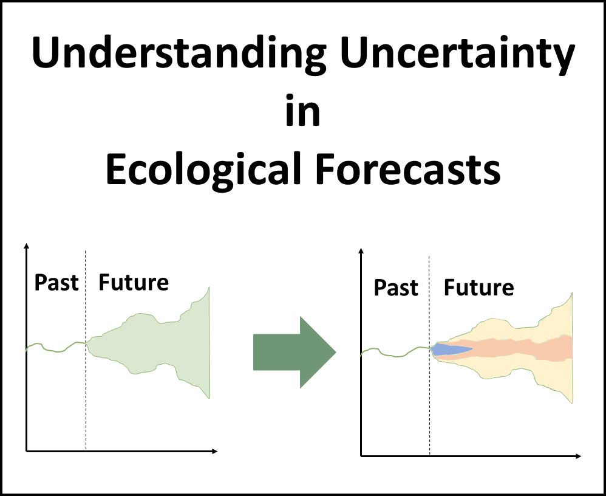

```{r setup, include=FALSE}
knitr::opts_chunk$set(echo = FALSE)
```
```{r}
time <- Sys.time()


# Read in assessment questions
# Load and format questions
quest <- read.csv("data/student_questions.csv", row.names = 1)

idx <- which(grepl("Name of selected ", quest$Question))
idx2 <- which(grepl("Elevation", quest$Question))
# Number rows
row.names(quest) <- NULL
row.names(quest)[1:(idx-1)] <- paste0("q", 1:(idx-1))
row.names(quest)[idx:(idx2)] <- paste0("q", (idx-1), letters[1:length(idx:idx2)])
row.names(quest)[(idx2+1):nrow(quest)] <- paste0("q", ((idx2+1):nrow(quest) - 6))
qid <- row.names(quest)
# Number location
quest$location[1:(idx-1)] <- paste0(quest$location[1:(idx-1)], " - Q.", 1:(idx-1))
# quest$location[idx:(idx2)] <- paste0(quest$location[idx:idx2],letters[1:length(idx:idx2)], ". ", )
quest$location[(idx2+1):nrow(quest)] <- paste0(quest$location[(idx2+1):nrow(quest)], " - Q.", ((idx2+1):nrow(quest) - 6))

answers <- params$answers
plot_list <- params$plot_list
# plot_list[[1]] <- "www/out_plots/airt_wtemp_ts.png"

plt_chk <- lapply(plot_list, function(x) {
  if(is.na(x)) {
    return(FALSE)
  } else {
    file.exists(x)
  }
})


if(answers == "") {
  answers <- quest
quest$location <- NULL
colnames(answers)[1] <- "Answer"
answers[, 1] <- ""
}

# Load in text
module_text <- read.csv("data/module_text.csv", row.names = 1, header = FALSE)


```


***
### Name: `r params$name`  
### Student ID: `r params$id_number` 
#### Completed on: `r time`
***

# **Macrosystems EDDIE Module 6: Understanding Uncertainty in Ecological Forecasts**


# Learning Objectives:

By the end of this module, you will be able to:

- Define ecological forecast uncertainty
- Explore the contributions of different sources of uncertainty (e.g., model parameters, model driver data) to total forecast uncertainty
- Outline how multiple sources of uncertainty are quantified
- Identify ways in which uncertainty can be reduced within an ecological forecast
- Describe how forecast horizon affects forecast uncertainty
- Explain the importance of specifying uncertainty in ecological forecasts for application

{width=250px}

# Why macrosystems ecology and ecological forecasting?

**Macrosystems ecology** is the study of ecological dynamics at multiple interacting spatial and temporal scales (e.g., Heffernan et al. 2014). For example, _global_ climate change can interact with _local_ land-use activities to control how an ecosystem changes over the next decades. Macrosystems ecology recently emerged as a new sub-discipline of ecology to study ecosystems and ecological communities around the globe that are changing at an unprecedented rate because of human activities (IPCC 2013). The responses of ecosystems and communities are complex, non-linear, and driven by feedbacks across local, regional, and global scales (Heffernan et al. 2014). These characteristics necessitate novel approaches for making predictions about how systems may change to improve both our understanding of ecological phenomena as well as inform resource management.  


**Forecasting** is a tool that can be used for understanding and predicting macrosystems dynamics. To anticipate and prepare for increased variability in populations, communities, and ecosystems, there is a pressing need to know the future state of ecological systems across space and time (Dietze et al. 2018). Ecological forecasting is an emerging approach which provides an estimate of the future state of an ecological system with uncertainty, allowing society to prepare for changes in important ecosystem services. Ecological forecasts are a powerful test of the scientific method because ecologists make a hypothesis of how an ecological system works; embed their hypothesis in a model; use the model to make a forecast of future conditions; and then when observations become available, assess the accuracy of their forecast, which indicates if their hypothesis is supported or needs to be updated. Forecasts that are effectively communicated to the public and managers will be most useful for aiding decision-making. Consequently, macrosystems ecologists are increasingly using ecological forecasts to predict how ecosystems are changing over space and time (Dietze and Lynch 2019).  
\
In this module, students will apply the iterative forecasting cycle to develop an ecological forecast for a National Ecological Observation Network (NEON) site of their choice. This module will introduce students to the basic components of an ecological forecast; how a forecasting model is constructed; how changes to model inputs affect forecast uncertainty; and how productivity forecasts vary across ecoclimatic domains.  \

## Module overview:

- Introduction to Ecological Forecasting: pre-readings and PowerPoint in class
- Activity A: Build a model to predict water temperature with uncertainty
- Activity B: Explore the different sources of uncertainty
- Activity C: Managing uncertainty
\

## Today's focal question: _Where does forecast uncertainty come from and how can it be quantified and reduced?_

To address this question, we will introduce ecological forecasts and the iterative forecasting cycle. We will build a model that forecasts water temperature with uncertainty. We will then explore the different sources of uncertainty associated with our forecast predictions. In this module, we will use our model to examine where forecast uncertainty comes from and how it propagates through time due to driver data, model parameters, and initial conditions. We will then compare water temperature forecasts for ecosystems in different ecoclimatic regions to understand how forecasts can vary both over time and space.

We will be using ecological data collected by the National Ecological Observation Network (NEON) to tackle this question. NEON is a continental-scale observatory designed to collect publicly-available, long-term ecological data to monitor changing ecosystems across the U.S. Water temperature exerts a major influence on biological activity and growth, has an effect on water chemistry, can influence water quantity measurements, and governs the kinds of organisms that live in water bodies.

## R Shiny App:

The lesson content is hosted on an R Shiny App at [https://macrosystemseddie.shinyapps.io/module6/](https://macrosystemseddie.shinyapps.io/module6/)  
This can be accessed via any internet browser and allows you to navigate through the lesson via this app. You will fill in the questions below on this handout as you complete the lesson activities.

## Optional pre-class readings and video:

Webpages:

- [NOAA Ecological Forecasts](https://oceanservice.noaa.gov/ecoforecasting/noaa.html#:~:text=What%20is%20ecological%20forecasting%3F,%2C%20pollution%2C%20or%20habitat%20change.)
- [Ecological Forecasting Initiative](https://ecoforecast.org/about/)

Articles:

- Dietze, M. and Lynch, H. 2019. Forecasting a bright future for ecology. _Frontiers in Ecology and the Environment_, _17_(1), 3. [https://doi.org/10.1002/fee.1994](https://doi.org/10.1002/fee.1994)
- Dietze, M.C., et al. 2018. Iterative near-term ecological forecasting: Needs, opportunities, and challenges. Proceedings of the National Academy of Sciences, 115(7), 1424–1432. [https://doi.org/10.1073/pnas.1710231115](https://doi.org/10.1073/pnas.1710231115)
- Jackson, L.J., Trebitz, A.S., &amp; Cottingham, K.L. 2000. An introduction to the practice of ecological modeling. BioScience, 50(8), 694. [https://doi.org/10.1641/0006-3568(2000)050[0694:aittpo]2.0.co;2](https://doi.org/10.1641/0006-3568(2000)050%5B0694:aittpo%5D2.0.co;2)

Videos:

- NEON&#39;s [Ecological Forecast: The Science of Predicting Ecosystems](https://www.youtube.com/watch?v=Lgi_e7N-C8E&amp;t=196s&amp;pbjreload=101)
- Fundamentals of Ecological Forecasting Series: [Why Forecast?](https://www.youtube.com/watch?v=kq0DTcotpA0&amp;list=PLLWiknuNGd50Lc3rft4kFPc_oxAhiQ-6s&amp;index=1)

The questions you must answer are embedded in the Shiny interface. You can answer the questions there and generate a report at the end or you can fill out the questions within this document.

# Think about it!
\
Answer the following questions:

1. `r quest[qid[1], 1]`  
\
**Answer:** `r answers[qid[1], 1]`\

2. `r quest[qid[2], 1]`   
\
**Answer:** `r answers[qid[2], 1]`\


Now navigate to the [Shiny interface](https://macrosystemseddie.shinyapps.io/module6) to answer the rest of the questions.

# Site Selection

## Objective 1: Select and view a NEON site\

***
`r module_text["obj_01", ]`

***

3. `r quest[qid[3], 1]`  

*Table 1. Site Characteristics*

| | |
| --- | --- |
| `r quest[qid[4], 1]` | `r answers[qid[4], 1]` |
| `r quest[qid[5], 1]` | `r answers[qid[5], 1]` |
| `r quest[qid[6], 1]` | `r answers[qid[6], 1]` |
| `r quest[qid[7], 1]` | `r answers[qid[7], 1]` |
| `r quest[qid[8], 1]` | `r answers[qid[8], 1]` |
| `r quest[qid[9], 1]` | `r answers[qid[9], 1]` |
\

## Objective 2: Explore data\

***
`r module_text["obj_02", ]`

***

4. `r quest[qid[10], 1]`  
\
**Answer:** `r answers[qid[10], 1]`\

5. `r quest[qid[11], 1]`   
\
**Answer:** `r answers[qid[11], 1]`\


# Activity A - Build a Model with Uncertainty

## Objective 3: Build a water temperature model\

***
`r module_text["obj_03", ]`

***

6. `r quest[qid[12], 1]`
\
**Answer:** `r answers[qid[12], 1]`  
\

```{r results='asis', echo=FALSE}
if (!plt_chk[[1]]) {cat("<!---")}
```
  
*Figure 1. TEST*
```{r results='asis', echo=FALSE}
if (!plt_chk[[1]]) {cat("-->")}
```

7. `r quest[qid[13], 1]`  
\
**Answer:** `r answers[qid[13], 1]`  
\

8. `r quest[qid[14], 1]`  
\
**Answer:** `r answers[qid[14], 1]`  
\

Figure Timeseries of models

9. `r quest[qid[15], 1]`  
\
**Answer:** `r answers[qid[15], 1]`  
\

10. `r quest[qid[16], 1]`  
\
**Answer:** `r answers[qid[16], 1]`  
\

Table of models & RMSE

## Objective 4: Explore Parameters\

***
`r module_text["obj_04", ]`

***

11. `r quest[qid[17], 1]`  
\
**Answer:** `r answers[qid[17], 1]`  
\

Plot of parameter distributions

## Objective 5: Improve Model for Forecasting\

***
`r module_text["obj_05", ]`

***

### Persistence model\

Plot of Persistence model


12. `r quest[qid[18], 1]`  
\
**Answer:** `r answers[qid[18], 1]`  
\

Plot of better models

Table of better models


13. `r quest[qid[19], 1]`  
\
**Answer:** `r answers[qid[19], 1]`  
\
14. `r quest[qid[20], 1]`  
\
**Answer:** `r answers[qid[20], 1]`  
\
15. `r quest[qid[21], 1]`  
\
**Answer:** `r answers[qid[21], 1]`  
\


# Activity B: Explore Forecast Uncertainty\

## Overview\

***
`r module_text["act_B_overview", ]`
***

### Deterministic forecasting\

TEXT

TABLE OF MODELS


Plot of Deterministic forecast


16. `r quest[qid[22], 1]`  
\
**Answer:** `r answers[qid[22], 1]`  
\


## Objective 6: Process Uncertainty\

***
`r module_text["obj_06", ]`

***

Plot of Proc UC

17. `r quest[qid[23], 1]`  
\
**Answer:** `r answers[qid[23], 1]`  
\


## Objective 7: Parameter Uncertainty\

***
`r module_text["obj_07", ]`

***

Plots of parameter UC

Plot of forecast

18. `r quest[qid[24], 1]`  
\
**Answer:** `r answers[qid[24], 1]`  
\
19. `r quest[qid[25], 1]`  
\
**Answer:** `r answers[qid[25], 1]`  
\

## Objective 8: Initial Conditions Uncertainty\

***
`r module_text["obj_08", ]`

***

Timeseries plot & Distribution plot

Forecast plot

20. `r quest[qid[26], 1]`  
\
**Answer:** `r answers[qid[26], 1]`  
\
21. `r quest[qid[27], 1]`  
\
**Answer:** `r answers[qid[27], 1]`  
\
22. `r quest[qid[28], 1]`  
\
**Answer:** `r answers[qid[28], 1]`  
\

## Objective 9: Driver Uncertainty\

***
`r module_text["obj_09", ]`
***

Plot of Weather FC
Plot of forecas

23. `r quest[qid[29], 1]`  
\
**Answer:** `r answers[qid[29], 1]`  
\
24. `r quest[qid[30], 1]`  
\
**Answer:** `r answers[qid[30], 1]`  
\

## Summary\
***
`r module_text["act_B_summ", ]`

***

Plot of all forecasts together

### Discussion Questions\

_Use the figures above to answer the questions._


Q. `r module_text["actB_q1", ]`\
Q. `r module_text["actB_q2", ]`\
Q. `r module_text["actB_q3", ]`\


# Activty C: Managing Uncertainty\

## Objective 10: Quantify Uncertainty\

***
`r module_text["obj_10", ]`
***

### Model 1\

Plot of Model 1 Forecasts

Plot of Model 1 Forecasts UC


### Model 2\

Plot of model 2

## Objective 11: Management Scenario\

***
`r module_text["obj_11", ]`
***

Plot of decision 1
Decision Made

Plot of decision 2
Decision Made


## Activity C: Summary\


This module was developed by Moore, T.N., C.C. Carey, and R.Q. Thomas. 13 October 2021. Macrosystems EDDIE: Understanding Uncertainty in Ecological Forecasts. Macrosystems EDDIE Module 6, Version 1. http://module5.macrosystemseddie.org. Module development was supported by NSF grants DEB-1926050 and DBI-1933016.

This document last modified: 04 November 2021 by TNM.
